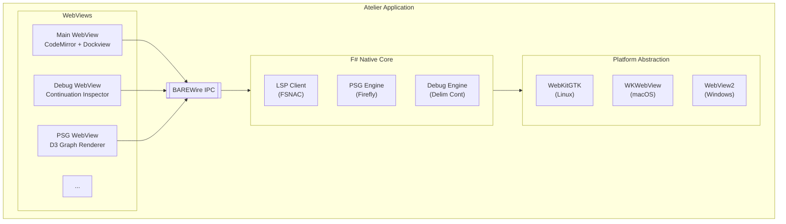

# Atelier

[](LICENSE)
[](Commercial.md)
[]()

> **Note:** This project is currently in the preliminary design phase. The documentation describes the intended architecture and features. Implementation has not yet begun.

**A Purpose-Built Editor for the Fidelity Ecosystem**

Atelier (French for "workshop" or "studio") is a dedicated development environment designed using the [WREN Stack](https://speakez.tech/blog/wren-stack/) (**W**ebView + **R**eactive + **E**mbedded + **N**ative). While a "pure native" UI is in the works, we plan to use a hybrid model that's lighter than Electron and has enough performance for highly responsive interactive work. It's currently designed specifically for F# Native development with the Fidelity framework.

## A WREN Stack Application

Atelier aims to be a first-class demonstration of what the WREN Stack enables: a lean, native foundation with a reactive web frontend, delivering the polish of modern web UI with the performance of native code.

Like its namesake bird, WREN Stack applications are designed to be lightweight and quick to start. Atelier embodies this philosophy, a craftsman's tool that respects computational resources while providing the sophisticated tooling that compiler development demands.



## Why Atelier?

Modern development environments are computationally profligate. Electron apps bundle entire browser runtimes, consuming gigabytes of memory to display text. VSCode, while feature-rich, carries the weight of universal compatibility at the cost of specialized excellence.

Atelier takes a different path: purpose-built tooling for the Fidelity ecosystem, with deep integration into Firefly's compilation pipeline.

| Capability | VSCode/Electron | NeoVim | Atelier |
|------------|-----------------|--------|---------|
| Memory footprint | ~500MB+ | ~50MB | ~80MB target (native + WebView) |
| Startup time | 2-5 seconds | <100ms | <200ms target |
| PSG visualization | Plugin (limited) | Not practical | Planned D3 integration |
| Delimited continuation debugging | Not supported | Not supported | Planned first-class support |
| Multi-WebView architecture | Single process | N/A | Planned isolated WebViews |
| WebGPU compute | Limited | N/A | Planned direct access |

### Guiding Design Principles

1. **Computational Responsibility**: Justify every byte of memory, every CPU cycle
2. **Compiler-Aware Tooling**: Pursue deep integration with Firefly's PSG and MLIR pipeline
3. **Native Performance**: Target F# Native backend compiled by Firefly, no managed runtime
4. **Web-Class UI**: Embrace SolidJS reactivity with CodeMirror 6's proven editor foundation
5. **Multi-WebView Architecture**: Enable thread isolation for debugging, monitoring, visualization

## The WREN Stack Advantage

The WREN Stack eliminates the false choice between native performance and modern UI:

- **WebView as rendering surface**: System WebView (WebKitGTK, WKWebView, WebView2) instead of bundled Chromium
- **Reactive UI through Partas.Solid**: F# compiles to both native backend and JavaScript frontend from shared types
- **Embedded assets**: HTML, CSS, and assets frozen into the binary's read-only memory
- **Native F# logic**: Compiled through Firefly to machine code, communicating via BAREWire IPC

The result: desktop applications that start in milliseconds, consume minimal memory, and feel native, because they are.

## Technology Stack

### Frontend (WebView)
- **[Partas.Solid](https://github.com/Partas/Partas.Solid)**: F# bindings for SolidJS via Fable
- **SolidJS**: Fine-grained reactivity, components run once
- **CodeMirror 6**: Modern editor with Lezer parsing, LSP support
- **solid-dockview**: VS Code-style panel docking with floating windows
- **D3.js**: PSG graph visualization
- **xterm.js**: Terminal emulation with WebGL renderer

### Backend (F# Native)
- **Firefly-compiled**: No .NET runtime dependency
- **BAREWire IPC**: Binary typed messaging, no JSON overhead
- **FSNAC LSP**: F# Native language server
- **PTY integration**: Native terminal support

### Platform Layer
- Inspired by WRY/Tauri abstraction patterns
- Conditional compilation for platform-specific WebView implementations
- Script message handlers for bidirectional communication

## Envisioned Capabilities

### PSG Visualization

Atelier contemplates providing real-time visualization of Firefly's Program Semantic Graph, the intermediate representation that carries type information, coeffects, and semantic relationships through compilation. The goal: watch your code transform from syntax to semantics to MLIR.

### Delimited Continuation Debugging

The design calls for first-class debugging support for delimited continuations, the foundation of Fidelity's async model. Plans include stepping through continuation captures and resumptions, inspecting continuation frames, and visualizing the control flow that traditional debuggers cannot represent.

### Multi-WebView Architecture

Each major function is intended to run in its own WebView with its own JavaScript context. The editor, debugger, PSG visualizer, and terminal would be isolated, a crash in one wouldn't affect the others. This architecture also looks toward WebGPU compute in visualization WebViews without affecting editor responsiveness.

## Documentation

See the [docs/](./docs/) folder for detailed documentation:

- [00_architecture.md](./docs/00_architecture.md): WREN architecture deep dive
- [01_webview_abstraction.md](./docs/01_webview_abstraction.md): Platform WebView lessons from WRY
- [02_solid_components.md](./docs/02_solid_components.md): Partas.Solid bindings for CodeMirror and Dockview
- [03_unique_features.md](./docs/03_unique_features.md): Delimited continuations, PSG visualization
- [04_multi_webview.md](./docs/04_multi_webview.md): Multi-WebView architecture
- [05_webgpu.md](./docs/05_webgpu.md): WebGPU compute integration
- [06_partas_solid.md](./docs/06_partas_solid.md): Partas.Solid, F# to SolidJS compilation
- [07_lezer_parsing.md](./docs/07_lezer_parsing.md): Lezer, CodeMirror's incremental parsing foundation
- [08_tooling_integration.md](./docs/08_tooling_integration.md): Integration with the Fidelity toolchain

## Building

*Coming soon; requires Firefly compiler and WREN Stack infrastructure*

```bash
# Build the native backend
firefly compile Atelier.fidproj

# Build the frontend
cd frontend && npm run build

# Run
./Atelier
```

## Related Projects

| Project | Description |
|---------|-------------|
| [Firefly](https://github.com/speakeztechnologies/Firefly) | F# Native AOT compiler |
| [FSNAC](https://github.com/speakeztechnologies/FsNativeAutoComplete) | F# Native language server |
| [BAREWire](https://github.com/speakeztechnologies/BAREWire) | Schema-driven binary serialization |

## The Name

*Atelier* - a workshop or studio, especially for an artist or designer. A space where craft meets creation.

This editor is our workshop for building the Fidelity ecosystem: a tool made by compiler developers, for compiler developers, embodying the same principles of computational responsibility and native performance that define the framework itself.

## License

Dual-licensed under Apache 2.0 and a commercial license. See [LICENSE](LICENSE) and [Commercial.md](Commercial.md) for details.
