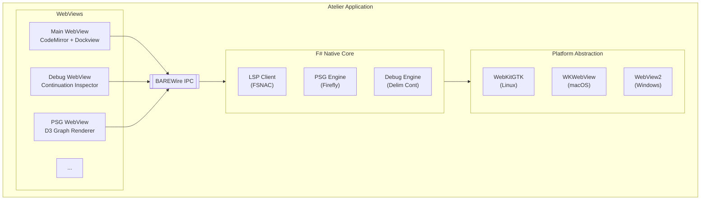

# Atelier

> **Note:** This project is currently in the preliminary design phase. The documentation describes the intended architecture and features. Implementation has not yet begun.

**The Fidelity Framework IDE - Self-Hosting via WRENStack**

Atelier (French for "workshop" or "studio") is the professional development environment for the Fidelity ecosystem. It will be **self-hosting** - built using the [WREN Stack](https://speakez.tech/blog/wren-stack/) (**W**ebView + **R**eactive + **E**mbedded + **N**ative) that it supports.

As a Fidelity IDE, Atelier provides deep integration with Firefly's compilation pipeline, PSG visualization, and delimited continuation debugging. As a WRENStack application, it demonstrates the architecture pattern: Partas.Solid frontend, Firefly-compiled backend, BAREWire IPC.

While FidelityUI (a future native UI model) is planned, WRENStack provides an interim path using proven web technology with native-quality performance.

## Self-Hosting WRENStack

Atelier is both the **tool** and the **demonstration**:

- **As a Fidelity IDE**: Deep integration with Firefly's compilation pipeline, including PSG visualization, nanopass inspection, and delimited continuation debugging
- **As a WRENStack application**: A lean, native foundation with a reactive web frontend, proving the architecture it supports

The self-hosting aspect is intentional: Atelier will be used to develop Fidelity applications, including future versions of Atelier itself. This creates a tight feedback loop where improvements to the compiler directly benefit the IDE, and IDE requirements drive compiler evolution.

Like its namesake bird, WRENStack applications are designed to be lightweight and quick to start. Atelier embodies this philosophy - a craftsman's tool that respects computational resources while providing the sophisticated tooling that compiler development demands.

```mermaid
flowchart TB
    subgraph app["Atelier Application"]
        subgraph webviews["WebViews"]
            main["Main WebView<br/>CodeMirror + Dockview"]
            debug["Debug WebView<br/>Continuation Inspector"]
            psg["PSG WebView<br/>D3 Graph Renderer"]
            more["..."]
        end

        ipc[["BAREWire IPC"]]

        subgraph core["F# Native Core"]
            lsp["LSP Client<br/>(FSNAC)"]
            psgeng["PSG Engine<br/>(Firefly)"]
            debugeng["Debug Engine<br/>(Delim Cont)"]
        end

        subgraph platform["Platform Abstraction"]
            linux["WebKitGTK<br/>(Linux)"]
            macos["WKWebView<br/>(macOS)"]
            windows["WebView2<br/>(Windows)"]
        end
    end

    main & debug & psg --> ipc
    ipc --> core
    core --> platform
```

## Why Atelier?

Modern development environments are computationally profligate. Electron apps bundle entire browser runtimes, consuming gigabytes of memory to display text. VSCode, while feature-rich, carries the weight of universal compatibility at the cost of specialized excellence.

Atelier takes a different path: purpose-built tooling for the Fidelity ecosystem, with deep integration into Firefly's compilation pipeline.

| Capability | VSCode/Electron | NeoVim | Atelier |
|------------|-----------------|--------|---------|
| Memory footprint | ~500MB+ | ~50MB | ~80MB target (native + WebView) |
| Startup time | 2-5 seconds | <100ms | <200ms target |
| PSG visualization | Plugin (limited) | Not practical | Planned D3 integration |
| Delimited continuation debugging | Not supported | Not supported | Planned first-class support |
| Multi-WebView architecture | Single process | N/A | Planned isolated WebViews |
| WebGPU compute | Limited | N/A | Planned direct access |

### Guiding Design Principles

1. **Computational Responsibility**: Justify every byte of memory, every CPU cycle
2. **Compiler-Aware Tooling**: Pursue deep integration with Firefly's PSG and MLIR pipeline
3. **Native Performance**: Target F# Native backend compiled by Firefly, no managed runtime
4. **Web-Class UI**: Embrace SolidJS reactivity with CodeMirror 6's proven editor foundation
5. **Multi-WebView Architecture**: Enable thread isolation for debugging, monitoring, visualization

## The WREN Stack Advantage

The WREN Stack eliminates the false choice between native performance and modern UI:

- **WebView as rendering surface**: System WebView (WebKitGTK, WKWebView, WebView2) instead of bundled Chromium
- **Reactive UI through Partas.Solid**: F# compiles to both native backend and JavaScript frontend from shared types
- **Embedded assets**: HTML, CSS, and assets frozen into the binary's read-only memory
- **Native F# logic**: Compiled through Firefly to machine code, communicating via BAREWire IPC

The result: desktop applications that start in milliseconds, consume minimal memory, and feel native, because they are.

## Technology Stack

### Frontend (WebView)
- **[Partas.Solid](https://github.com/Partas/Partas.Solid)**: F# bindings for SolidJS via Fable
- **SolidJS**: Fine-grained reactivity, components run once
- **CodeMirror 6**: Modern editor with Lezer parsing, LSP support
- **solid-dockview**: VS Code-style panel docking with floating windows
- **D3.js**: PSG graph visualization
- **xterm.js**: Terminal emulation with WebGL renderer

### Backend (F# Native)
- **Firefly-compiled**: No .NET runtime dependency
- **BAREWire IPC**: Binary typed messaging, no JSON overhead
- **FSNAC LSP**: F# Native language server
- **PTY integration**: Native terminal support

### Platform Layer
- Inspired by WRY/Tauri abstraction patterns
- Conditional compilation for platform-specific WebView implementations
- Script message handlers for bidirectional communication

## Envisioned Capabilities

### PSG Visualization

Atelier contemplates providing real-time visualization of Firefly's **Program Semantic Graph** - the intermediate representation that carries type information, coeffects, and semantic relationships through the nanopass pipeline.

The PSG captures the **Four Pillars** architecture:
- **Coeffects** (mise-en-place) - Resource requirements marked on nodes before code generation
- **Active Patterns** - Semantic lenses that classify nodes by operation kind
- **Zipper traversal** - The "camera" that moves through the graph, never dispatching
- **Templates** - Parameterized MLIR emission patterns

The goal: watch your code transform through each nanopass phase, from syntax construction through typed tree overlay to MLIR generation.

### Delimited Continuation Debugging

The design calls for first-class debugging support for delimited continuations, the foundation of Fidelity's async model. Plans include stepping through continuation captures and resumptions, inspecting continuation frames, and visualizing the control flow that traditional debuggers cannot represent.

### Multi-WebView Architecture

Each major function is intended to run in its own WebView with its own JavaScript context. The editor, debugger, PSG visualizer, and terminal would be isolated - a crash in one wouldn't affect the others. This architecture also looks toward WebGPU compute in visualization WebViews without affecting editor responsiveness.

### WRENStack Design-Time Experience

Atelier integrates with [WRENStack.Tooling](https://github.com/speakeztechnologies/WRENStack.Tooling) to enhance the development experience for WRENStack applications:

- **Source Maps** - Debug F# source, not generated JavaScript
- **Signal Inspector** - Browser devtools integration for SolidJS signals
- **Component Navigation** - Jump between F# component definitions and usage
- **HMR State Preservation** - Hot reload without losing signal state

These tools work together to bring the debugging experience closer to native F# development.

## Documentation

See the [docs/](./docs/) folder for detailed documentation:

- [00_architecture.md](./docs/00_architecture.md): WREN architecture deep dive
- [01_webview_abstraction.md](./docs/01_webview_abstraction.md): Platform WebView lessons from WRY
- [02_solid_components.md](./docs/02_solid_components.md): Partas.Solid bindings for CodeMirror and Dockview
- [03_unique_features.md](./docs/03_unique_features.md): Delimited continuations, PSG visualization
- [04_multi_webview.md](./docs/04_multi_webview.md): Multi-WebView architecture
- [05_webgpu.md](./docs/05_webgpu.md): WebGPU compute integration
- [06_partas_solid.md](./docs/06_partas_solid.md): Partas.Solid, F# to SolidJS compilation
- [07_lezer_parsing.md](./docs/07_lezer_parsing.md): Lezer, CodeMirror's incremental parsing foundation
- [08_tooling_integration.md](./docs/08_tooling_integration.md): Integration with the Fidelity toolchain
- [09_flow_loss_analysis.md](./docs/09_flow_loss_analysis.md): Data-flow parallelism analysis and hardware partnership strategy

## Related Projects

| Project | Description |
|---------|-------------|
| [Firefly](https://github.com/speakeztechnologies/Firefly) | F# Native AOT compiler |
| [FSNAC](https://github.com/speakeztechnologies/FsNativeAutoComplete) | F# Native language server |
| [BAREWire](https://github.com/speakeztechnologies/BAREWire) | Schema-driven binary serialization |
| [WRENStack.Tooling](https://github.com/speakeztechnologies/WRENStack.Tooling) | Design-time tooling for WRENStack applications |
| [Partas.Solid](https://github.com/Partas/Partas.Solid) | F# → SolidJS via Fable |

## The Name

*Atelier* - a workshop or studio, especially for an artist or designer. A space where craft meets creation.

This editor is our workshop for building the Fidelity ecosystem: a tool made by compiler developers, for compiler developers, embodying the same principles of computational responsibility and native performance that define the framework itself.

## License

Dual-licensed under Apache 2.0 and a commercial license. See [LICENSE](LICENSE) and [Commercial.md](Commercial.md) for details.
