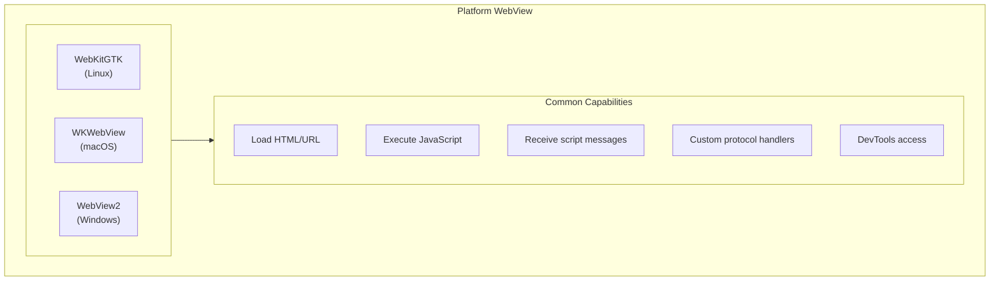
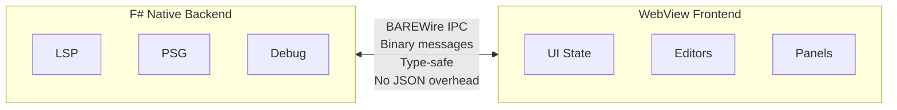
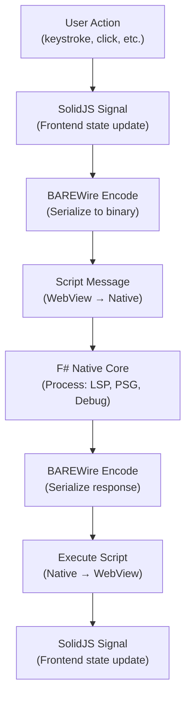
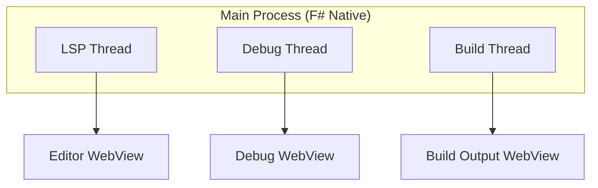

# 00 - WREN Architecture

## The WREN Stack

**W**ebView + **R**eactive + **E**mbedded + **N**ative

WREN represents a fundamental rethinking of desktop application architecture. Rather than embedding a full browser runtime (Electron) or constraining ourselves to native-only UI toolkits (GTK widgets, Qt), WREN looks toward leveraging the platform's existing WebView infrastructure with a native F# backend.

## Why WREN?

### The Electron Problem

Electron applications bundle Chromium (~150MB) and Node.js (~30MB) into every application. A "Hello World" in Electron ships as a 180MB+ binary that consumes 300-500MB of RAM at runtime.

This is computationally irresponsible.

### The Native-Only Problem

Pure native toolkits (GTK, Qt, native F#/WinForms) offer efficiency but lack the rich, expressive UI capabilities that web technologies provide. Building a sophisticated code editor UI in pure GTK is possible but requires enormous effort.

### The WREN Solution

Every modern operating system ships with a WebView component:
- **Linux**: WebKitGTK (GTK4 integration)
- **macOS**: WKWebView (WebKit)
- **Windows**: WebView2 (Chromium-based, ships with Windows 11, downloadable for 10)

These WebViews are already present, already maintained, and already consuming memory for other applications. WREN aspires to use them directly, avoiding the Electron tax while gaining web UI capabilities.

## Architecture Layers

### Layer 1: Platform WebView

The lowest layer will provide raw WebView access:



Each platform provides these capabilities through different APIs, but the semantics are remarkably similar.

### Layer 2: F# Native Abstraction

Atelier plans to abstract platform differences using F# discriminated unions and conditional compilation:

```fsharp
type WebViewHandle =
    | WebKitGTK of nativeint  // GtkWidget*
    | WKWebView of nativeint  // WKWebView*
    | WebView2 of nativeint   // ICoreWebView2*

type WebViewConfig = {
    Title: string
    Width: int
    Height: int
    DevTools: bool
    Transparent: bool
}

// Platform-specific initialization
#if LINUX
let create config = WebKitGTK (webkitgtk_create config)
#elif MACOS
let create config = WKWebView (wkwebview_create config)
#elif WINDOWS
let create config = WebView2 (webview2_create config)
#endif
```

### Layer 3: IPC Protocol (BAREWire)

Communication between F# Native backend and WebView frontend is intended to use BAREWire, a binary typed protocol:



Why not JSON?
- Parsing overhead on every message
- No type safety (runtime errors)
- Verbose encoding (strings for everything)

BAREWire aims to provide:
- Zero-copy deserialization where possible
- Compile-time type checking
- Minimal wire format

### Layer 4: Reactive Frontend (SolidJS)

The WebView is designed to run a SolidJS application with fine-grained reactivity:

```typescript
// SolidJS - components run ONCE, only signals update
const [fileContent, setFileContent] = createSignal("")
const [diagnostics, setDiagnostics] = createSignal<Diagnostic[]>([])

// This component body runs once
function Editor() {
  // Only the signal reads re-execute
  return (
    <CodeMirror
      value={fileContent()}
      extensions={[lspExtension(diagnostics())]}
    />
  )
}
```

This is fundamentally different from React's re-render model:
- **React**: Component functions re-execute on every state change
- **SolidJS**: Component functions run once; signal reads are tracked and update surgically

For an editor that anticipates thousands of updates per second (keystrokes, LSP responses, debug events), this efficiency becomes essential.

## Data Flow



## Memory Model

Atelier's projected memory footprint:

| Component | Approximate Size |
|-----------|-----------------|
| F# Native binary | ~5MB |
| WebKitGTK shared libs | Already loaded by system |
| WebView process | ~30-50MB |
| SolidJS app | ~2MB |
| CodeMirror | ~3MB |
| **Total** | **~40-60MB** |

Compare to:
- VSCode: 300-500MB
- Atom (RIP): 400-700MB
- Sublime Text: 80-100MB

## Thread Model

The multi-WebView architecture aims to enable true thread isolation:



Each WebView runs in its own process (WebKit/Chromium architecture). This means heavy operations (debugging, build monitoring) should not freeze the editor UI.

## Navigation

- Previous: [README](../README.md)
- Next: [01_webview_abstraction.md](./01_webview_abstraction.md): Platform abstraction patterns from WRY
