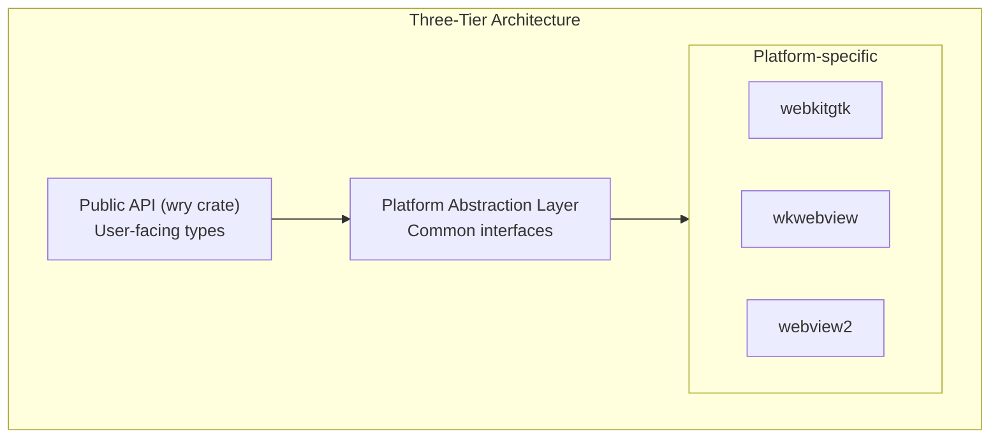

# 01 - WebView Abstraction: Lessons from WRY

## WRY Overview

[WRY](https://github.com/tauri-apps/wry) (WebView Rendering librarY) is the Rust library that powers Tauri's cross-platform WebView support. Studying WRY's architecture provides valuable lessons for Atelier's F# Native implementation.

## WRY's Abstraction Strategy

### Three-Tier Architecture

WRY organizes code into three tiers:



### No Explicit Trait (Structural Polymorphism)

Interestingly, WRY does NOT define an explicit `WebView` trait. Instead, it uses **conditional compilation** to swap implementations:

```rust
// In wry/src/lib.rs
#[cfg(target_os = "linux")]
mod webkitgtk;
#[cfg(target_os = "linux")]
pub use webkitgtk::*;

#[cfg(target_os = "macos")]
mod wkwebview;
#[cfg(target_os = "macos")]
pub use wkwebview::*;

#[cfg(target_os = "windows")]
mod webview2;
#[cfg(target_os = "windows")]
pub use webview2::*;
```

Each platform module exports the same public API, but the implementations differ. This is **structural polymorphism** - the types have the same shape without sharing a base type.

### Why No Trait?

1. **Compile-time resolution** - Only one platform's code is compiled
2. **No vtable overhead** - Direct calls, no dynamic dispatch
3. **Platform-specific extensions** - Each platform can expose unique features

## F# Native Adaptation

### Option 1: Discriminated Union (Runtime Selection)

```fsharp
type WebViewHandle =
    | WebKitGTK of nativeint
    | WKWebView of nativeint
    | WebView2 of nativeint

let loadUrl handle url =
    match handle with
    | WebKitGTK ptr -> WebKitGTK.loadUrl ptr url
    | WKWebView ptr -> WKWebView.loadUrl ptr url
    | WebView2 ptr -> WebView2.loadUrl ptr url
```

**Pros**: Single binary for all platforms, runtime platform detection
**Cons**: Dead code for unused platforms, match overhead

### Option 2: Conditional Compilation (WRY-style)

```fsharp
// WebView.fs - public API
#if LINUX
open Atelier.Platform.WebKitGTK
#elif MACOS
open Atelier.Platform.WKWebView
#elif WINDOWS
open Atelier.Platform.WebView2
#endif

let create config = platformCreate config
let loadUrl handle url = platformLoadUrl handle url
let executeScript handle script = platformExecuteScript handle script
```

**Pros**: No dead code, no match overhead, platform-specific features
**Cons**: Separate builds per platform

### Recommendation: Hybrid Approach

For Atelier, use conditional compilation for the core WebView operations, but allow runtime detection for cross-platform development scenarios:

```fsharp
module WebView =
    #if LINUX
    let private impl = WebKitGTK.implementation
    #elif MACOS
    let private impl = WKWebView.implementation
    #elif WINDOWS
    let private impl = WebView2.implementation
    #endif

    let create = impl.create
    let loadUrl = impl.loadUrl
    let executeScript = impl.executeScript
    let addScriptMessageHandler = impl.addScriptMessageHandler
```

## Platform-Specific Patterns from WRY

### WebKitGTK (Linux)

Key files in WRY: `src/webkitgtk/mod.rs`, `src/webkitgtk/web_context.rs`

```fsharp
// F# Native adaptation
module WebKitGTK =
    [<DllImport("libwebkit2gtk-4.1.so")>]
    extern nativeint webkit_web_view_new()

    [<DllImport("libwebkit2gtk-4.1.so")>]
    extern void webkit_web_view_load_uri(nativeint webview, string uri)

    [<DllImport("libwebkit2gtk-4.1.so")>]
    extern void webkit_web_view_run_javascript(
        nativeint webview,
        string script,
        nativeint cancellable,
        nativeint callback,
        nativeint userData)

    // Script message handler registration
    [<DllImport("libwebkit2gtk-4.1.so")>]
    extern nativeint webkit_user_content_manager_register_script_message_handler(
        nativeint manager,
        string name)
```

**WebKitGTK IPC Pattern:**
```javascript
// Frontend sends message
window.webkit.messageHandlers.wrendit.postMessage({
    type: "lsp_request",
    payload: binaryData
})
```

```fsharp
// Backend receives via signal
let handleScriptMessage (manager: nativeint) (result: nativeint) =
    let value = webkit_javascript_result_get_js_value result
    let message = jsc_value_to_string value
    processMessage message
```

### WKWebView (macOS)

Key files in WRY: `src/wkwebview/mod.rs`, `src/wkwebview/class/`

WRY uses Objective-C runtime interop:

```fsharp
// F# Native adaptation (conceptual)
module WKWebView =
    [<DllImport("libobjc.dylib")>]
    extern nativeint objc_msgSend(nativeint self, nativeint sel, ...)

    let WKWebView_class = objc_getClass "WKWebView"
    let alloc_sel = sel_registerName "alloc"
    let initWithFrame_configuration_sel =
        sel_registerName "initWithFrame:configuration:"
```

**WKWebView IPC Pattern:**
```javascript
// Frontend sends message
window.webkit.messageHandlers.wrendit.postMessage(binaryData)
```

```fsharp
// Backend receives via WKScriptMessageHandler delegate
type ScriptMessageHandler() =
    inherit NSObject()

    [<Export("userContentController:didReceiveScriptMessage:")>]
    member _.DidReceiveScriptMessage(controller, message) =
        let body = message.body
        processMessage body
```

### WebView2 (Windows)

Key files in WRY: `src/webview2/mod.rs`

WebView2 uses COM interfaces:

```fsharp
// F# Native adaptation (conceptual)
module WebView2 =
    [<DllImport("WebView2Loader.dll")>]
    extern int CreateCoreWebView2EnvironmentWithOptions(
        string browserExecutableFolder,
        string userDataFolder,
        nativeint options,
        nativeint handler)

    // ICoreWebView2 interface methods
    let navigate webview url =
        ICoreWebView2_Navigate(webview, url)

    let executeScript webview script callback =
        ICoreWebView2_ExecuteScript(webview, script, callback)
```

**WebView2 IPC Pattern:**
```javascript
// Frontend sends message
window.chrome.webview.postMessage(binaryData)
```

```fsharp
// Backend receives via WebMessageReceived event
let webMessageHandler sender args =
    let message = args.WebMessageAsJson
    processMessage message
```

## IPC Abstraction

### Unified Message Handler

Despite platform differences, WRY normalizes the IPC interface:

```fsharp
type MessageHandler = {
    Name: string
    Callback: byte[] -> Async<byte[]>
}

module IPC =
    let registerHandler (webview: WebViewHandle) (handler: MessageHandler) =
        #if LINUX
        WebKitGTK.registerScriptMessageHandler webview handler.Name handler.Callback
        #elif MACOS
        WKWebView.registerScriptMessageHandler webview handler.Name handler.Callback
        #elif WINDOWS
        WebView2.registerWebMessageHandler webview handler.Callback
        #endif

    let sendToFrontend (webview: WebViewHandle) (data: byte[]) =
        let script = sprintf "window.__wrendit_receive(%A)" (toBase64 data)
        executeScript webview script
```

### Frontend Helper

```javascript
// Unified frontend API
const WREN = {
    handlers: new Map(),

    send(type, payload) {
        const encoded = BAREWire.encode({ type, payload })
        // Platform detection
        if (window.webkit?.messageHandlers?.wrendit) {
            window.webkit.messageHandlers.wrendit.postMessage(encoded)
        } else if (window.chrome?.webview) {
            window.chrome.webview.postMessage(encoded)
        }
    },

    onMessage(type, handler) {
        this.handlers.set(type, handler)
    }
}

// Called by native side
window.__wrendit_receive = (base64Data) => {
    const decoded = BAREWire.decode(atob(base64Data))
    const handler = WREN.handlers.get(decoded.type)
    if (handler) handler(decoded.payload)
}
```

## Custom Protocol Handlers

WRY supports custom URL protocols for loading local resources:

```fsharp
// Register wrendit:// protocol
module CustomProtocol =
    let register (webview: WebViewHandle) =
        let handler (request: ProtocolRequest) =
            match request.Uri with
            | uri when uri.StartsWith("wrendit://app/") ->
                let path = uri.Substring("wrendit://app/".Length)
                let content = loadLocalFile path
                { StatusCode = 200; MimeType = guessMimeType path; Body = content }
            | _ ->
                { StatusCode = 404; MimeType = "text/plain"; Body = "Not found" }

        #if LINUX
        WebKitGTK.registerUriScheme webview "wrendit" handler
        #elif MACOS
        WKWebView.registerSchemeHandler webview "wrendit" handler
        #elif WINDOWS
        WebView2.addWebResourceRequestedFilter webview "wrendit://*" handler
        #endif
```

This allows the frontend to load resources via `wrendit://app/index.html` without file:// security restrictions.

## Key Takeaways from WRY

1. **Conditional compilation over runtime polymorphism** - Compile only what you need
2. **Structural polymorphism** - Same API shape, different implementations
3. **Unified IPC abstraction** - Hide platform message handler differences
4. **Custom protocols** - Secure resource loading without file:// issues
5. **Script evaluation with callbacks** - Bidirectional async communication
6. **DevTools toggle** - Essential for development

## Next Steps

- [02_solid_components.md](./02_solid_components.md) - CodeMirror and Dockview bindings
- [04_multi_webview.md](./04_multi_webview.md) - Multiple WebView architecture
