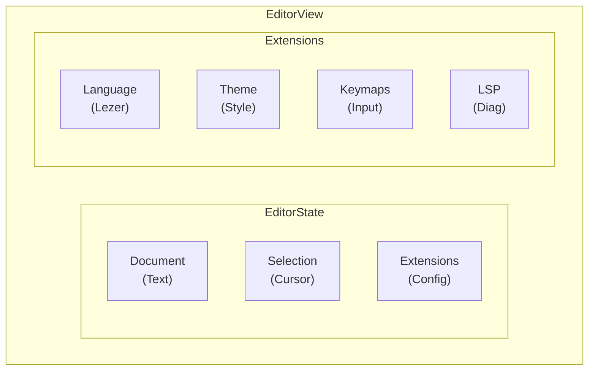
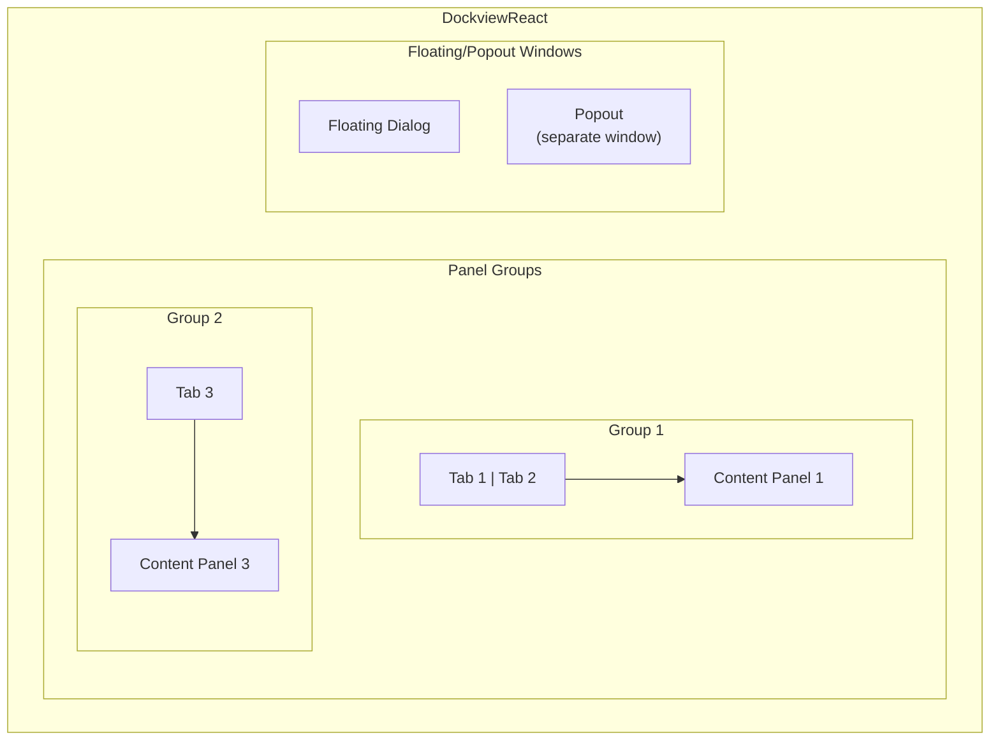

# 02 - Solid Components: CodeMirror and Dockview

## Overview

Atelier's frontend is built on two remarkable SolidJS libraries:

- **solid-codemirror** - CodeMirror 6 wrapper with reactive integration
- **solid-dockview** - VS Code-style docking panel system

Both integrate seamlessly with SolidJS's fine-grained reactivity model and will be exposed to F# via Partas.Solid bindings.

## CodeMirror 6: The Editor Foundation

CodeMirror 6 is a complete rewrite of the CodeMirror editor, built with modern principles:

### Why CodeMirror 6?

| Feature | Monaco (VSCode) | CodeMirror 6 |
|---------|-----------------|--------------|
| Bundle size | ~2.5MB | ~150KB core |
| Multi-instance | Heavy (shared worker) | Lightweight |
| Extensibility | Plugin API | Composable extensions |
| Mobile support | Limited | First-class |
| Accessibility | Good | Excellent |
| Language support | ~50 via TextMate | 20+ via Lezer + TextMate |

For Atelier's multi-pane architecture with potentially many editor instances, CodeMirror 6's lightweight footprint is essential.

### CodeMirror 6 Architecture



### solid-codemirror

[solid-codemirror](https://github.com/riccardoperra/solid-codemirror) wraps CodeMirror 6 with SolidJS reactivity:

```typescript
import { createCodeMirror, createEditorControlledValue } from 'solid-codemirror'
import { createSignal } from 'solid-js'

function Editor() {
  const [code, setCode] = createSignal("let x = 42")

  const { ref, editorView, createExtension } = createCodeMirror({
    value: code(),
    onValueChange: setCode
  })

  // Dynamic extension management via compartments
  const reconfigureTheme = createExtension(oneDark)

  // Later: reconfigureTheme(oneLight) to switch themes

  return <div ref={ref} />
}
```

**Key Features:**

1. **Compartments** - Dynamic extension reconfiguration without recreating the editor
2. **Controlled value** - Two-way binding between SolidJS signals and editor content
3. **Extension factory** - `createExtension` returns a reconfigure function

### Partas.Solid Bindings for solid-codemirror

```fsharp
// Fable bindings for solid-codemirror
module SolidCodeMirror

open Fable.Core
open Fable.Core.JsInterop

[<Import("createCodeMirror", "solid-codemirror")>]
let createCodeMirror: CodeMirrorOptions -> CodeMirrorResult = jsNative

[<Import("createEditorControlledValue", "solid-codemirror")>]
let createEditorControlledValue: EditorView -> (unit -> string) -> (string -> unit) -> unit = jsNative

type CodeMirrorOptions = {
    value: string option
    onValueChange: (string -> unit) option
    extensions: Extension[] option
}

type CodeMirrorResult = {
    ref: obj -> unit
    editorView: unit -> EditorView option
    createExtension: Extension -> (Extension -> unit)
}

// Higher-level F# API
module Editor =
    let create (initialValue: string) (onChange: string -> unit) =
        let options = {
            value = Some initialValue
            onValueChange = Some onChange
            extensions = Some [|
                fsharpLanguage
                oneDarkTheme
                lineNumbers()
                bracketMatching()
            |]
        }
        createCodeMirror options

    let withLSP (result: CodeMirrorResult) (diagnostics: Accessor<Diagnostic[]>) =
        // Create LSP extension with reactive diagnostics
        let lspExt = createLspExtension diagnostics
        result.createExtension lspExt
```

### CodeMirror 6 LSP Integration

CodeMirror 6 supports LSP via `@codemirror/lsp-client`:

```typescript
import { lspClient } from '@codemirror/lsp-client'

const lsp = lspClient({
  transport: {
    // Custom transport for BAREWire IPC
    send(message) {
      WREN.send('lsp_request', message)
    },
    onMessage(callback) {
      WREN.onMessage('lsp_response', callback)
    }
  },
  languageId: 'fsharp',
  rootUri: 'file:///project'
})

// Add to editor extensions
createCodeMirror({
  extensions: [
    lsp,
    // Diagnostics rendered automatically
    // Completions integrated
    // Hover info shown
  ]
})
```

### F# Language Support via Lezer

CodeMirror uses [Lezer](https://lezer.codemirror.net/) for incremental parsing. While F# doesn't have an official Lezer grammar, we can:

1. **Use TextMate grammar** via `@codemirror/legacy-modes` (like VSCode)
2. **Create Lezer grammar** for F# (better integration)
3. **Use generic highlighting** + LSP semantic tokens

For Atelier, starting with TextMate (option 1) then migrating to Lezer (option 2) is pragmatic.

## Dockview: Panel Management

[dockview](https://github.com/mathuo/dockview) provides VS Code-style docking with floating and popout windows.

### Dockview Architecture



### solid-dockview

[solid-dockview](https://www.npmjs.com/package/solid-dockview) is a SolidJS port of dockview:

```typescript
import { createDockview } from 'solid-dockview'

function IDE() {
  const { api, DockviewComponent } = createDockview({
    onReady: (event) => {
      // Add initial panels
      event.api.addPanel({
        id: 'editor-1',
        component: 'editor',
        params: { file: 'Program.fs' }
      })

      event.api.addPanel({
        id: 'terminal',
        component: 'terminal',
        position: { direction: 'below' }
      })
    },
    components: {
      editor: EditorPanel,
      terminal: TerminalPanel,
      psg: PSGVisualizerPanel
    }
  })

  return <DockviewComponent />
}
```

**Key Features:**

1. **Drag-and-drop** - Panels can be dragged between groups
2. **Floating windows** - Panels can float over the main layout
3. **Popout windows** - Panels can be detached to separate OS windows
4. **Layout serialization** - Save/restore layouts as JSON
5. **Resize handles** - Flexible panel sizing

### Partas.Solid Bindings for solid-dockview

```fsharp
// Fable bindings for solid-dockview
module SolidDockview

open Fable.Core
open Fable.Core.JsInterop

[<Import("createDockview", "solid-dockview")>]
let createDockview: DockviewOptions -> DockviewResult = jsNative

type DockviewOptions = {
    onReady: DockviewReadyEvent -> unit
    components: obj  // Record of component factories
}

type DockviewResult = {
    api: IDockviewApi
    DockviewComponent: obj  // SolidJS component
}

type IDockviewApi =
    abstract addPanel: AddPanelOptions -> IDockviewPanel
    abstract addGroup: AddGroupOptions option -> IDockviewGroup
    abstract removePanel: IDockviewPanel -> unit
    abstract toJSON: unit -> obj
    abstract fromJSON: obj -> unit
    abstract addFloatingGroup: IDockviewPanel -> FloatingGroupOptions -> unit
    abstract addPopoutGroup: IDockviewPanel -> PopoutGroupOptions -> unit

type AddPanelOptions = {
    id: string
    component: string
    title: string option
    position: PanelPosition option
    ``params``: obj option
}

type PanelPosition =
    | Left
    | Right
    | Above
    | Below
    | Within of string  // Group ID

// Higher-level F# API
module Dockview =
    let create (components: Map<string, obj -> JSX.Element>) (onReady: IDockviewApi -> unit) =
        let componentsObj = createObj (components |> Map.toList)
        createDockview {
            onReady = fun event -> onReady event.api
            components = componentsObj
        }

    let addEditorPanel (api: IDockviewApi) (file: string) =
        api.addPanel {
            id = sprintf "editor-%s" (hash file |> string)
            component = "editor"
            title = Some (Path.getFileName file)
            position = None
            ``params`` = Some (createObj ["file", file])
        }

    let addFloatingPanel (api: IDockviewApi) (panel: IDockviewPanel) =
        api.addFloatingGroup panel {
            x = 100
            y = 100
            width = 600
            height = 400
        }
```

### Layout Persistence

Dockview supports serializing layouts:

```fsharp
module Layout =
    let save (api: IDockviewApi) : string =
        api.toJSON() |> JSON.stringify

    let restore (api: IDockviewApi) (json: string) =
        let layout = JSON.parse json
        api.fromJSON layout

    let defaultLayout = """
    {
      "grid": {
        "orientation": "HORIZONTAL",
        "root": {
          "type": "branch",
          "data": [
            { "type": "leaf", "data": { "id": "editor-group" } },
            { "type": "leaf", "data": { "id": "sidebar-group" }, "size": 300 }
          ]
        }
      },
      "panels": {
        "editor-1": { "id": "editor-1", "component": "editor" },
        "psg": { "id": "psg", "component": "psg-viewer" }
      }
    }
    """
```

## Integrating CodeMirror with Dockview

### Editor Panel Component

```fsharp
// EditorPanel.fs
module EditorPanel

open Fable.Core
open SolidCodeMirror
open SolidDockview

let EditorPanel (props: {| file: string; api: IPanelApi |}) =
    let (content, setContent) = createSignal ""
    let (diagnostics, setDiagnostics) = createSignal [||]

    // Load file content
    onMount (fun () ->
        async {
            let! text = WREN.request "read_file" props.file
            setContent text
        } |> Async.StartImmediate
    )

    // Subscribe to LSP diagnostics
    onMount (fun () ->
        WREN.subscribe "diagnostics" (fun diags ->
            if diags.uri = props.file then
                setDiagnostics diags.diagnostics
        )
    )

    let { ref; editorView; createExtension } = Editor.create (content()) (fun newContent ->
        setContent newContent
        WREN.send "file_changed" {| file = props.file; content = newContent |}
    )

    // Wire up LSP extension with reactive diagnostics
    let _ = Editor.withLSP { ref = ref; editorView = editorView; createExtension = createExtension } diagnostics

    div [ class' "editor-panel" ] [
        div [ ref ref; class' "editor-container" ] []
    ]
```

### Main IDE Component

```fsharp
// IDE.fs
module IDE

open SolidDockview
open EditorPanel
open TerminalPanel
open PSGViewer

let IDE () =
    let components = Map.ofList [
        "editor", EditorPanel
        "terminal", TerminalPanel
        "psg", PSGViewer
    ]

    let { DockviewComponent } = Dockview.create components (fun api ->
        // Restore saved layout or use default
        let savedLayout = localStorage.getItem "wrenedit-layout"
        if savedLayout <> null then
            Layout.restore api savedLayout
        else
            // Create default layout
            api.addPanel { id = "editor-1"; component = "editor"; title = Some "Welcome"; position = None; ``params`` = None }
            api.addPanel { id = "terminal"; component = "terminal"; title = Some "Terminal"; position = Some Below; ``params`` = None }
            api.addPanel { id = "psg"; component = "psg"; title = Some "PSG"; position = Some (Within "sidebar"); ``params`` = None }

        // Save layout on change
        api.onDidLayoutChange (fun () ->
            localStorage.setItem("wrenedit-layout", Layout.save api)
        )
    )

    div [ class' "ide-root" ] [
        DockviewComponent
    ]
```

## Styling with DaisyUI

While DaisyUI doesn't provide docking panels (that's Dockview's job), it provides excellent styling:

```css
/* Use DaisyUI themes */
@import "daisyui/dist/full.css";

/* Apply to dockview */
.dv-dockview {
  --dv-tab-active-background: hsl(var(--b2));
  --dv-tab-inactive-background: hsl(var(--b1));
  --dv-border-color: hsl(var(--b3));
}

.editor-panel {
  @apply bg-base-100;
}

/* CodeMirror theming via CSS variables */
.cm-editor {
  --cm-background: hsl(var(--b1));
  --cm-foreground: hsl(var(--bc));
}
```

## Summary

The combination of solid-codemirror and solid-dockview provides:

1. **Professional editor** - CodeMirror 6 with full LSP support
2. **Flexible layout** - VS Code-style docking with floating/popout windows
3. **SolidJS integration** - Fine-grained reactivity, components run once
4. **F# bindings** - Partas.Solid enables type-safe F# development

This foundation enables Atelier to rival VSCode's UX while maintaining the lean WREN Stack architecture.

## Next Steps

- [03_unique_features.md](./03_unique_features.md) - Delimited continuations debugging, PSG visualization
- [04_multi_webview.md](./04_multi_webview.md) - Multi-WebView architecture
