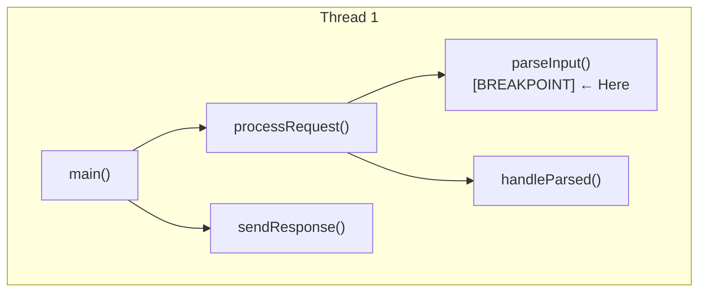
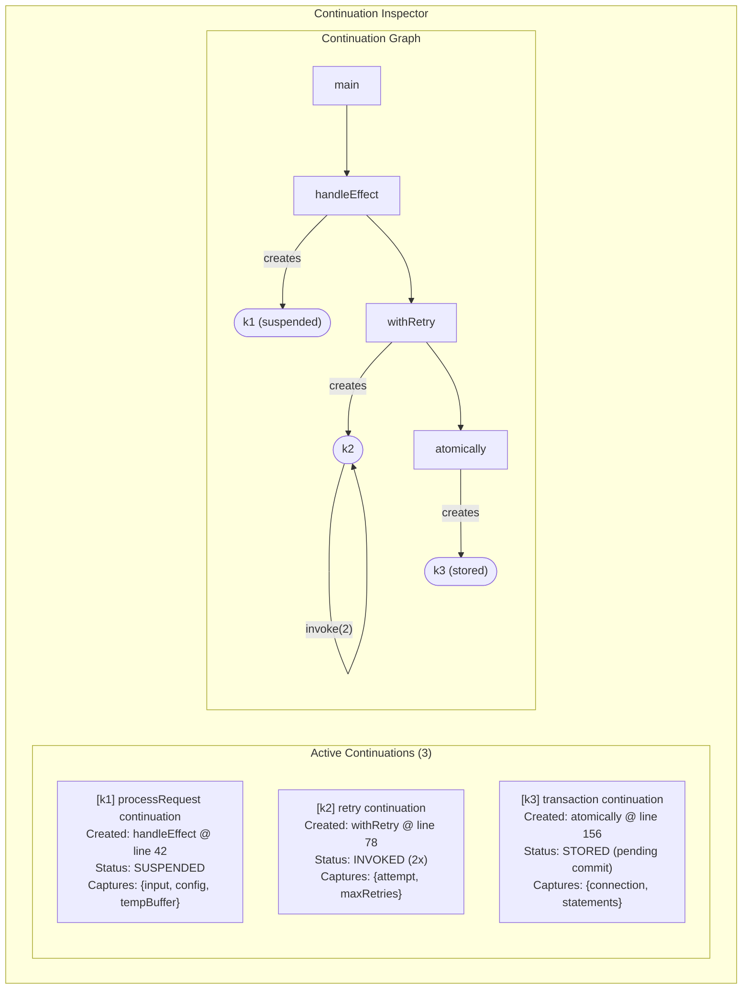
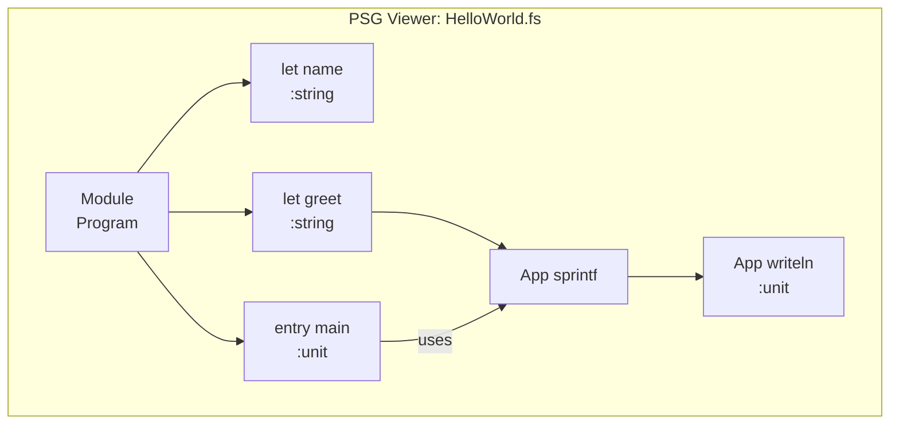
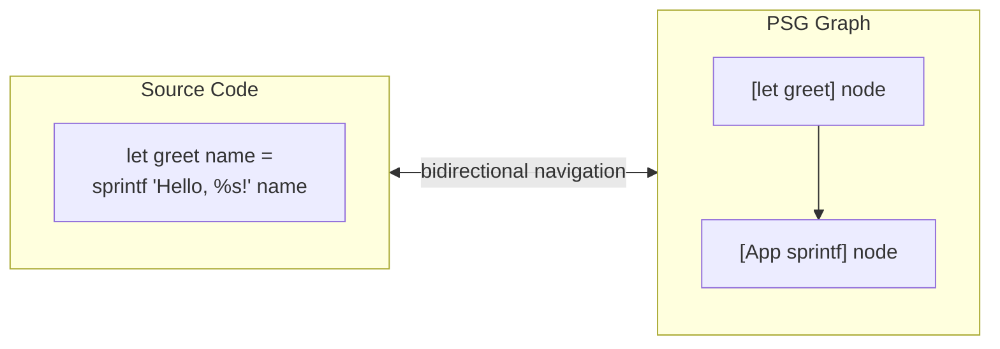
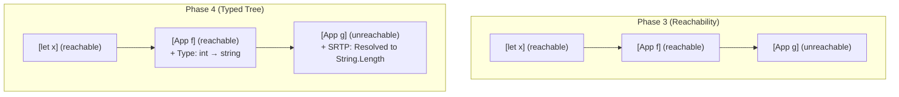
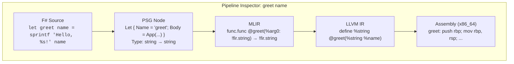
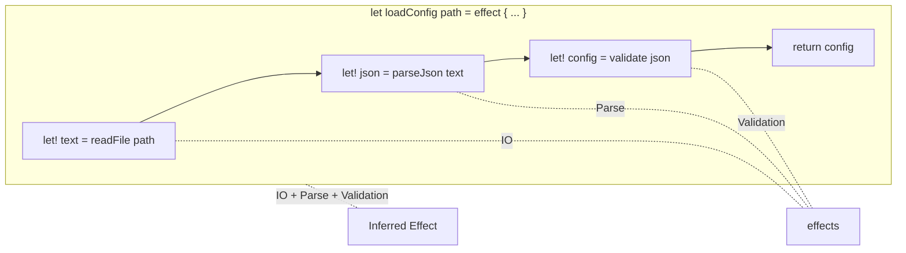
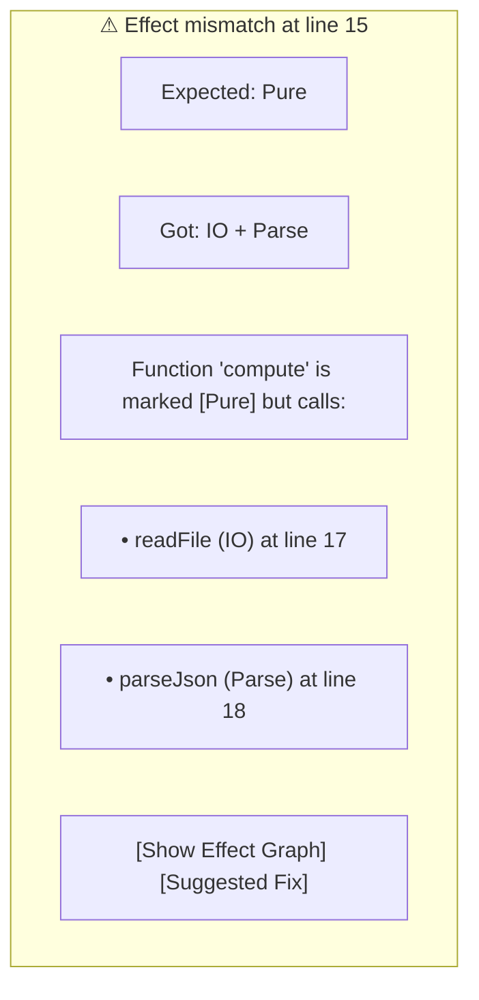

# 03 - Unique Features: Beyond VSCode and NeoVim

## The Opportunity

VSCode and NeoVim are general-purpose editors. They excel at breadth but cannot provide depth for specialized domains. Atelier, designed specifically for the Fidelity ecosystem, aspires to offer capabilities that general editors fundamentally cannot.

## Feature 1: Delimited Continuation Debugging

### The Problem with Traditional Debuggers

Traditional debuggers operate on a stack-based mental model:



This model breaks down with delimited continuations. A continuation captures "the rest of the computation" and can be:
- Stored for later
- Invoked multiple times
- Passed across threads
- Serialized and transmitted

```fsharp
// Fidelity delimited continuation
let handler = effect {
    let! input = shift (fun k ->
        // k is the continuation "the rest of processRequest"
        // We might invoke it 0, 1, or many times
        // We might store it and invoke later
        storeForLater k
        defaultResponse
    )
    // ... rest of computation
}
```

### Atelier's Planned Continuation Inspector

Atelier aims to provide specialized debugging for delimited continuations:



### Proposed Implementation Architecture

```fsharp
// Native debug engine integration
module ContinuationDebugger

type ContinuationInfo = {
    Id: ContinuationId
    CreatedAt: SourceLocation
    Status: ContinuationStatus
    CapturedBindings: Map<string, Value>
    InvocationHistory: InvocationRecord list
    ParentContinuation: ContinuationId option
}

type ContinuationStatus =
    | Suspended
    | Invoked of count: int
    | Stored of location: string
    | Completed

// Debug events sent to frontend
type DebugEvent =
    | ContinuationCreated of ContinuationInfo
    | ContinuationInvoked of ContinuationId * InvocationRecord
    | ContinuationStored of ContinuationId * string
    | ContinuationCompleted of ContinuationId

// Frontend subscribes to events
WREN.subscribe "debug_event" (function
    | ContinuationCreated info -> updateContinuationList (Add info)
    | ContinuationInvoked (id, record) -> updateInvocationGraph id record
    | _ -> ()
)
```

### Why This Would Matter

No existing debugger provides this capability because:

1. **Traditional runtimes don't have delimited continuations**: .NET, JVM, V8 don't expose continuation primitives
2. **Stack-based mental models are embedded**: Debugger UIs assume call stacks
3. **General editors can't integrate deeply**: VSCode's DAP assumes traditional debugging

Atelier, designed for Fidelity, would:
- Understand continuation semantics natively
- Visualize non-linear control flow
- Track continuation lifecycle (creation → suspension → invocation → completion)
- Show captured closures explicitly

## Feature 2: PSG Visualization with D3

### The Program Semantic Graph

Firefly's PSG (Program Semantic Graph) is the compiler's intermediate representation:

```
F# Source → FCS → PSG → Nanopasses → Alex → MLIR → Native
```

The PSG captures:
- Syntax structure (from SynExpr)
- Type information (from FSharpExpr)
- Def-use relationships
- Reachability information
- SRTP resolutions

### Envisioned PSG Viewer



*Filters: Values, Calls | Phase: Typed Tree Overlay*

*Selected: `let greet` | Type: string | Range: HelloWorld.fs:3:5-3:42*

### D3-Based Rendering

[D3.js](https://d3js.org/) provides the visualization engine:

```typescript
// PSG Graph rendering with D3
import * as d3 from 'd3'

interface PSGNode {
  id: string
  kind: string
  label: string
  type?: string
  range: SourceRange
  isReachable: boolean
}

interface PSGEdge {
  source: string
  target: string
  kind: 'ChildOf' | 'DefUse' | 'Call' | 'Type'
}

function renderPSG(container: HTMLElement, nodes: PSGNode[], edges: PSGEdge[]) {
  const svg = d3.select(container).append('svg')

  // Force-directed layout
  const simulation = d3.forceSimulation(nodes)
    .force('link', d3.forceLink(edges).id(d => d.id))
    .force('charge', d3.forceManyBody().strength(-300))
    .force('center', d3.forceCenter(width / 2, height / 2))

  // Render edges
  const link = svg.selectAll('.edge')
    .data(edges)
    .join('line')
    .attr('class', d => `edge edge-${d.kind}`)

  // Render nodes
  const node = svg.selectAll('.node')
    .data(nodes)
    .join('g')
    .attr('class', d => `node node-${d.kind} ${d.isReachable ? '' : 'unreachable'}`)
    .call(d3.drag())

  node.append('rect')
    .attr('width', 80)
    .attr('height', 40)

  node.append('text')
    .text(d => d.label)

  // Click to select
  node.on('click', (event, d) => {
    WREN.send('psg_node_selected', d.id)
  })
}
```

### Bidirectional Navigation

The PSG Viewer would enable bidirectional navigation:



Clicking a node would highlight the corresponding source. Clicking source would highlight the corresponding node.

```fsharp
// Source → PSG navigation
WREN.onMessage "source_cursor_moved" (fun pos ->
    let node = findNodeAtPosition psg pos
    highlightNode node.Id
)

// PSG → Source navigation
WREN.onMessage "psg_node_selected" (fun nodeId ->
    let node = psg.GetNode nodeId
    jumpToSource node.Range
)
```

### Phase Comparison

The PSG evolves through nanopass phases. The viewer would allow comparing phases:



Switching phases shows how the PSG gains information:
- Phase 1-2: Structure only
- Phase 3: Reachability marks
- Phase 4: Type information, SRTP resolution
- Phase 5+: Def-use edges, operation classification

## Feature 3: Compilation Pipeline Inspector

### Seeing the Full Picture

Atelier envisions displaying the entire compilation pipeline for a selection:



This would allow developers to:
- Understand how F# maps to native code
- Debug code generation issues
- Learn compiler internals
- Verify optimization decisions

## Feature 4: Effect System Awareness

### Visualizing Effects

Fidelity's effect system is designed to track computational effects:

```fsharp
// Effect-annotated code
let readFile path : IO<string> = ...
let parseJson text : Parse<Json> = ...
let validate json : Validation<Config> = ...

// Effect composition visible in editor
let loadConfig path =
    effect {
        let! text = readFile path       // IO
        let! json = parseJson text       // Parse
        let! config = validate json      // Validation
        return config
    }
// Inferred effect: IO + Parse + Validation
```

Atelier would display effect annotations inline:



### Effect Mismatch Diagnostics

When effects don't compose correctly, diagnostics could appear as:



## Summary

Atelier's unique features would arise from deep integration with the Fidelity ecosystem:

| Feature | Enabled By |
|---------|-----------|
| Continuation debugging | Fidelity's delimited continuation runtime |
| PSG visualization | Direct access to Firefly's IR |
| Pipeline inspection | Integration with all compilation phases |
| Effect awareness | FNCS effect system |

These capabilities would be difficult or impossible in general-purpose editors because they require knowledge of specific compiler internals that only purpose-built tooling can provide.

## Navigation

- Previous: [02_solid_components.md](./02_solid_components.md): CodeMirror and Dockview bindings
- Next: [04_multi_webview.md](./04_multi_webview.md): Multi-WebView architecture
