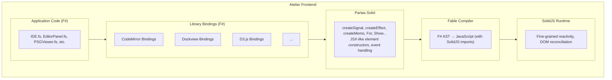

# 06 - Partas.Solid: F# to SolidJS Compilation

## Role in the Stack

Partas.Solid provides F# bindings for SolidJS, compiled through Fable. This enables the same F# types to be used in both the native backend (compiled by Firefly) and the WebView frontend (compiled by Fable to JavaScript).

The architectural benefit: a single type definition flows through both compilation targets, eliminating serialization mismatches at the IPC boundary.

## What is Partas.Solid?

[Partas.Solid](https://github.com/Partas/Partas.Solid) is a Fable binding library that enables writing SolidJS applications in F#. It compiles F# to JavaScript that uses SolidJS's reactive primitives.

```fsharp
// F# code using Partas.Solid
open Partas.Solid

let Counter () =
    let count, setCount = createSignal 0

    div [] [
        p [] [ text $"Count: {count()}" ]
        button [ onClick (fun _ -> setCount (count() + 1)) ] [
            text "Increment"
        ]
    ]
```

Compiles to:

```javascript
// Generated JavaScript (simplified)
import { createSignal } from 'solid-js'

function Counter() {
    const [count, setCount] = createSignal(0)

    return (
        <div>
            <p>Count: {count()}</p>
            <button onClick={() => setCount(count() + 1)}>
                Increment
            </button>
        </div>
    )
}
```

## Shared Types Across Compilation Targets

### Type Flow Example

The same F# types compile to both targets:

```fsharp
// Shared types (used by both native backend and WebView frontend)
type Diagnostic = {
    Range: SourceRange
    Severity: DiagnosticSeverity
    Message: string
    Code: string option
}

type PSGNode = {
    Id: NodeId
    Kind: string
    Label: string
    Type: string option
    Range: SourceRange
    IsReachable: bool
}

// Backend (F# Native via Firefly)
let sendDiagnostics (webview: WebViewHandle) (diagnostics: Diagnostic[]) =
    WREN.send webview "diagnostics" diagnostics

// Frontend (F# via Fable + Partas.Solid)
let DiagnosticsList () =
    let diagnostics, setDiagnostics = createSignal<Diagnostic[]> [||]

    onMount (fun () ->
        WREN.onMessage "diagnostics" setDiagnostics
    )

    ul [] [
        For (diagnostics()) (fun diag ->
            li [ class' (severityClass diag.Severity) ] [
                text $"{diag.Range}: {diag.Message}"
            ]
        )
    ]
```

The `Diagnostic` type is defined once. Firefly compiles it to a native struct. Fable compiles it to a JavaScript object. BAREWire handles serialization at the boundary.

### SolidJS Reactive Primitives

Partas.Solid exposes SolidJS's fine-grained reactivity:

```fsharp
// Signals - reactive state
let count, setCount = createSignal 0

// Effects - side effects that track dependencies
createEffect (fun () ->
    printfn $"Count changed to: {count()}"
)

// Memos - computed values
let doubled = createMemo (fun () -> count() * 2)

// Resources - async data fetching
let userData = createResource userId (fun id ->
    async { return! fetchUser id }
)
```

### Component Model

```fsharp
// Components are just functions
let Button (props: {| onClick: unit -> unit; children: Node |}) =
    button [
        class' "btn btn-primary"
        onClick (fun _ -> props.onClick())
    ] [
        props.children
    ]

// Usage
Button {| onClick = (fun () -> save()); children = text "Save" |}
```

### Control Flow Components

SolidJS's control flow components are available:

```fsharp
// Conditional rendering
Show (isLoading()) (fun () ->
    Spinner ()
)

// List rendering with keyed updates
For (items()) (fun item ->
    ItemRow {| item = item |}
)

// Pattern matching
Switch [
    Match (status() = Loading) (fun () -> Spinner ())
    Match (status() = Error) (fun () -> ErrorMessage ())
    Match (status() = Ready) (fun () -> Content ())
]
```

## Binding External Libraries

Partas.Solid provides the foundation, but Atelier needs bindings for:
- solid-codemirror
- solid-dockview
- xterm.js
- D3.js

### Binding Pattern

```fsharp
// Fable binding for solid-codemirror
module SolidCodeMirror

open Fable.Core
open Fable.Core.JsInterop
open Partas.Solid

[<Import("createCodeMirror", "solid-codemirror")>]
let private createCodeMirrorJS: obj -> obj = jsNative

type CodeMirrorOptions = {
    value: string option
    onValueChange: (string -> unit) option
}

type CodeMirrorResult = {
    ref: obj -> unit
    editorView: unit -> EditorView option
    createExtension: Extension -> (Extension -> unit)
}

let createCodeMirror (options: CodeMirrorOptions) : CodeMirrorResult =
    let jsOptions = createObj [
        if options.value.IsSome then "value" ==> options.value.Value
        if options.onValueChange.IsSome then "onValueChange" ==> options.onValueChange.Value
    ]
    let result = createCodeMirrorJS jsOptions
    {
        ref = result?ref
        editorView = fun () -> result?editorView() |> Option.ofObj
        createExtension = fun ext -> result?createExtension(ext)
    }
```

### Higher-Level F# API

```fsharp
// Idiomatic F# wrapper
module Editor

let create (initialValue: string) (onChange: string -> unit) =
    let result = createCodeMirror {
        value = Some initialValue
        onValueChange = Some onChange
    }

    // Return a component
    fun () ->
        div [ ref result.ref; class' "editor-container" ] []
```

## The Atelier Frontend Stack



Partas.Solid maps F# constructs to SolidJS primitives. The layers above it (library bindings, application code) are written in F# and compiled through this stack.

## Build Pipeline

```bash
# Frontend build
cd frontend

# Fable compiles F# to JavaScript
dotnet fable src/App.fsproj --outDir dist/js

# Vite bundles and optimizes
npx vite build

# Output: dist/app.js (SolidJS application)
```

The F# source files are transformed by Fable into JavaScript that imports from `solid-js`. The Partas.Solid library provides the types and functions that map to SolidJS's API.

## Why Not Other Options?

### Why not Feliz (React)?

React's re-render model is less efficient than SolidJS's fine-grained reactivity. For an editor receiving thousands of updates per second, this matters.

### Why not Bolero (Blazor)?

Blazor requires WebAssembly or server-side rendering. We want native JavaScript in the WebView for maximum compatibility and minimal overhead.

### Why not plain Fable + manual bindings?

You could write raw Fable bindings to SolidJS, but Partas.Solid provides:
- Idiomatic F# API
- Type-safe element constructors
- Proper handling of SolidJS's reactive primitives
- Community maintenance and updates

## Summary

Partas.Solid provides:

| Capability | Mechanism |
|------------|-----------|
| F# frontend code | SolidJS bindings via Fable |
| Type-safe UI | F# type system preserved through compilation |
| Shared types | Same F# types compile to native (Firefly) and JS (Fable) |
| Fine-grained reactivity | SolidJS primitive bindings |
| Library integration | Foundation for solid-codemirror, solid-dockview bindings |

## References

- [Partas.Solid GitHub](https://github.com/Partas/Partas.Solid)
- [Fable](https://fable.io/) - F# to JavaScript compiler
- [SolidJS](https://www.solidjs.com/) - Reactive UI library
