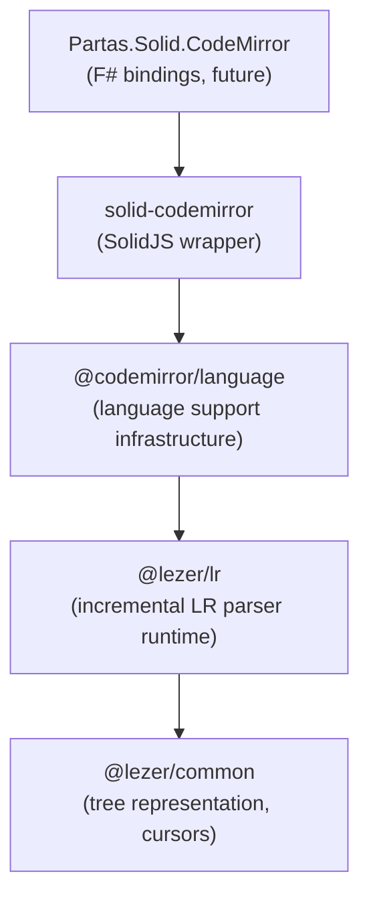
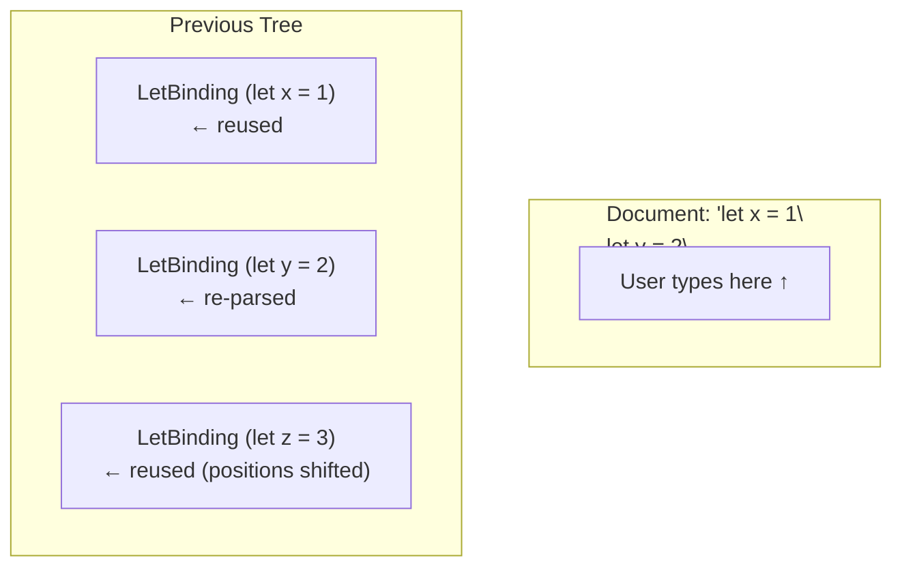
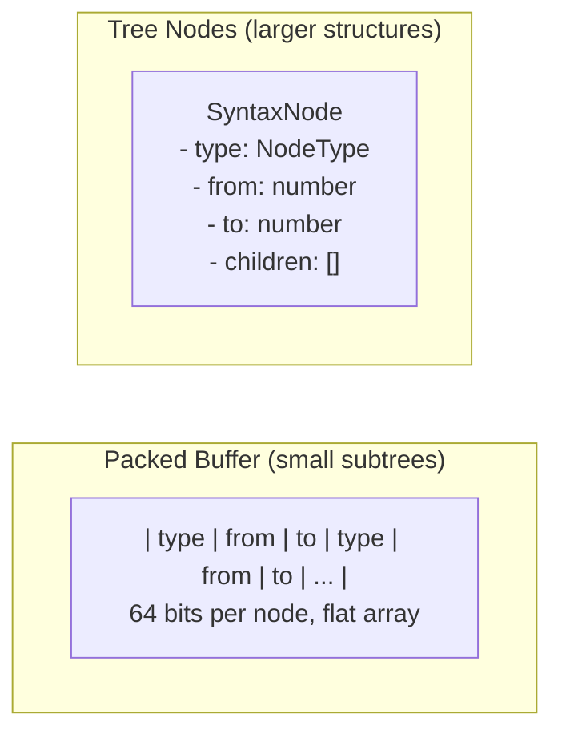

# 07 - Lezer: CodeMirror's Parsing Foundation

## Dependency Chain



Understanding Lezer is relevant for Atelier's planned features:
- Writing language support for F#
- Interpreting syntax trees for features like code folding
- Debugging highlighting issues
- Performance tuning for large files

## What Lezer Provides

Lezer is an incremental LR parser generator. It compiles grammar files to compact parse tables (JavaScript modules), which the runtime uses to produce concrete syntax trees.

Key distinction from traditional parsers: Lezer builds a **concrete syntax tree** (CST), not an abstract syntax tree (AST). The tree preserves all tokens, positions, and structure, which is what you need for editor features. Semantic analysis comes from the LSP.

## Incremental Parsing

When a user types, Lezer doesn't re-parse the entire file. It:

1. Receives tree fragments from the previous parse
2. Maps document changes to tree positions
3. Reuses unchanged subtrees
4. Re-parses only affected regions



Balanced subtrees from repeat operators (`*`, `+`) enable fine-grained reuse. A change inside one function doesn't trigger re-parsing of sibling functions.

## Grammar Syntax

Lezer grammars define both the parser and tokenizer:

```lezer
@top Program { statement* }

statement {
  LetBinding |
  FunctionDef |
  Expression ";"
}

LetBinding {
  kw<"let"> pattern "=" Expression
}

pattern {
  Identifier |
  TuplePattern
}

TuplePattern { "(" pattern ("," pattern)* ")" }

@tokens {
  Identifier { $[a-zA-Z_] $[a-zA-Z0-9_]* }
  Number { $[0-9]+ ("." $[0-9]+)? }
  String { '"' (!["\\] | "\\" _)* '"' }
  space { $[ \t\n\r]+ }
}

@skip { space | LineComment | BlockComment }

LineComment { "//" ![\n]* }
BlockComment { "/*" blockCommentContent* "*/" }
blockCommentContent { ![*] | "*" ![/] }

kw<term> { @specialize[@name={term}]<Identifier, term> }

@precedence {
  call,
  unary @right,
  mult @left,
  add @left,
  compare @left
}
```

### Grammar Elements

| Element | Purpose |
|---------|---------|
| `@top` | Entry point rule |
| Capitalized names | Create tree nodes |
| Lowercase names | Internal rules (no nodes) |
| `@tokens` | Lexer definitions (DFA-based) |
| `@skip` | Whitespace/comment handling |
| `@specialize` | Keywords overlapping identifiers |
| `@precedence` | Operator precedence/associativity |
| `@external` | Custom tokenizers (for complex cases) |

## Tree Representation

Lezer trees optimize for memory and locality:



### Tree Access

Two interfaces for traversal:

**SyntaxNode** (object-based, convenient):
```javascript
let node = tree.topNode
console.log(node.name, node.from, node.to)
for (let child of node.children) {
  // ...
}
```

**TreeCursor** (mutable, efficient for bulk traversal):
```javascript
let cursor = tree.cursor()
do {
  console.log(cursor.name, cursor.from, cursor.to)
} while (cursor.next())
```

TreeCursor avoids object allocation during traversal, which is relevant for large files.

## Error Recovery

Lezer uses GLR (Generalized LR) parsing for error recovery. When encountering invalid input:

1. Fork into multiple parse branches
2. Apply recovery strategies:
   - Skip unexpected tokens
   - Insert expected tokens
   - Force reduction of partial productions
3. Score branches by "badness" (recovery actions increase badness)
4. Prune branches exceeding threshold relative to best branch
5. Continue with surviving branches

This produces usable trees from partial/invalid code, which is essential for editing.

## External Tokenizers

Some languages require context-sensitive tokenization. Lezer supports external tokenizers written in JavaScript:

```javascript
import { ExternalTokenizer } from "@lezer/lr"

const indentTokenizer = new ExternalTokenizer((input, stack) => {
  // Access input stream and parser stack
  // Return token type based on context
  if (atLineStart && indentIncreased(input, stack)) {
    input.acceptToken(Indent)
  }
})
```

F#'s significant whitespace would require this approach.

## F# Language Support Options

The following outlines potential approaches for F# support in Atelier.

### Option 1: Full Lezer Grammar

Write a complete grammar for F#. Challenges include:

- **Significant whitespace**: Requires external tokenizer with indentation tracking
- **Computation expressions**: Context-dependent keywords (`let!`, `do!`, `return!`)
- **Type syntax**: Generic constraints, SRTPs, measure types
- **Preprocessor directives**: `#if`, `#else`, conditional compilation

This is substantial work. OCaml has a [Lezer grammar](https://github.com/ocaml/tree-sitter-ocaml) (via Tree-sitter) that could inform an F# implementation.

### Option 2: TextMate Grammar via Legacy Mode

CodeMirror's `@codemirror/legacy-modes` supports TextMate grammars. F# has an existing TextMate grammar (used by VSCode).

```javascript
import { StreamLanguage } from "@codemirror/language"
import { fSharp } from "@codemirror/legacy-modes/mode/mllike"

const fsharpLanguage = StreamLanguage.define(fSharp)
```

Produces a flat token stream, not a tree. Sufficient for basic highlighting.

### Option 3: LSP Semantic Tokens

FSNAC provides semantic token information. CodeMirror can display these:

```javascript
import { lspSemanticTokens } from "@codemirror/lsp-client"

// Semantic tokens from LSP override local highlighting
const extensions = [
  fsharpLanguage,  // Basic highlighting (TextMate)
  lspSemanticTokens()  // Enhanced highlighting from FSNAC
]
```

This layers LSP intelligence over basic highlighting.

### Recommended Approach for Atelier

The current thinking favors a phased approach:

1. **Start with TextMate**: Immediate basic highlighting
2. **Add LSP semantic tokens**: FSNAC provides accurate highlighting
3. **Consider Lezer grammar later**: If tree-based features (smart folding, structural navigation) prove valuable

The LSP already provides semantic understanding. A Lezer grammar could add local, offline tree access; useful but not essential for an initial implementation.

## CodeMirror Integration Points

When wrapping CodeMirror in Partas.Solid, these Lezer-related APIs become relevant:

```typescript
// Language definition
import { LRLanguage, LanguageSupport } from "@codemirror/language"

const fsharpLanguage = LRLanguage.define({
  parser: fsharpParser,  // From Lezer grammar
  languageData: {
    commentTokens: { line: "//" },
    closeBrackets: { brackets: ["(", "[", "{", '"'] }
  }
})

// Tree access in extensions
import { syntaxTree } from "@codemirror/language"

const myExtension = EditorView.updateListener.of(update => {
  const tree = syntaxTree(update.state)
  // Walk tree for custom features
})
```

F# bindings could expose these as:

```fsharp
module CodeMirror.Language

let syntaxTree (state: EditorState) : Tree =
    jsNative

let defineLanguage (parser: Parser) (data: LanguageData) : LRLanguage =
    jsNative
```

## Performance Characteristics

| Operation | Complexity | Notes |
|-----------|------------|-------|
| Initial parse | O(n) | Full document, LR parsing |
| Incremental parse | O(changed) | Reuses unchanged subtrees |
| Tree traversal | O(nodes visited) | TreeCursor avoids allocation |
| Node lookup by position | O(log n) | Binary search in sorted nodes |

For a 10,000-line file with a single character edit, incremental parsing typically touches <1% of nodes.

## Navigation

- Previous: [06_partas_solid.md](./06_partas_solid.md): Partas.Solid, F# to SolidJS compilation
- Next: [08_tooling_integration.md](./08_tooling_integration.md): Performance Tooling Integration

## References

- [Lezer System Guide](https://lezer.codemirror.net/docs/guide/)
- [Lezer Reference Manual](https://lezer.codemirror.net/docs/ref/)
- [Lezer Blog Post](https://marijnhaverbeke.nl/blog/lezer.html)
- [CodeMirror Language Package Example](https://codemirror.net/examples/lang-package/)
- [Lezer GitHub](https://github.com/lezer-parser)
