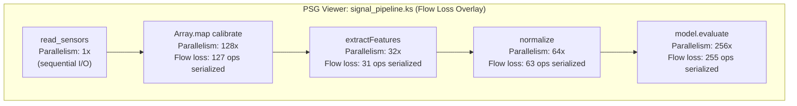
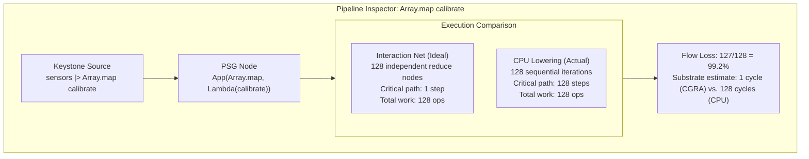
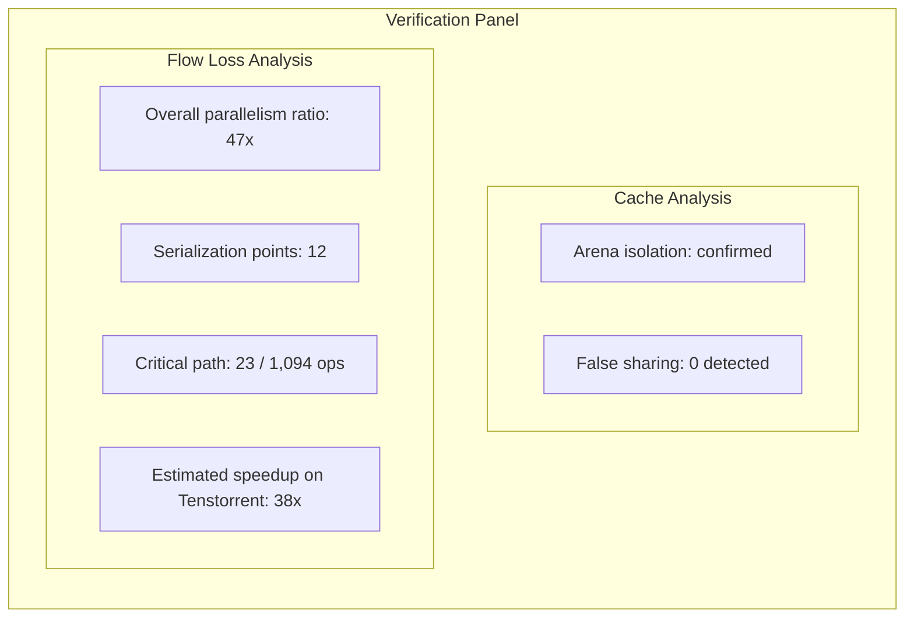

# 09 - Flow Loss Analysis

## Overview

Flow loss analysis quantifies how much data-flow parallelism a program contains that is serialized when targeting a control-flow architecture (CPU). Because Keystone is graph-native, the compiler holds both representations: the data-flow graph (PSG / interaction net) and the control-flow lowering (CPU Alex output). The delta between them is computable, and that delta is the flow loss.

This capability is structurally unique to graph-native languages. In conventional control-flow languages, recovering the data-flow graph from imperative code requires heroic analysis. In Keystone, the program IS the data-flow graph. The CPU lowering is a derived artifact. Comparing them is a natural operation within the compilation pipeline.

## Metrics

### Parallelism Ratio

How many operations could fire simultaneously on a data-flow fabric vs. how many the CPU must serialize. A function with 200 independent operations serialized to a single thread produces a very different ratio than a function with a deep dependency chain. This metric gives developers immediate intuition about how much their code would benefit from spatial hardware.

### Critical Path vs. Total Work

The ratio between the longest dependency chain (critical path length) and total operations. This is a well-understood metric from parallel computing theory:

- Ratio near 1.0: computation is inherently sequential, minimal flow loss
- Ratio near 0.01: 99% of work could execute concurrently on a spatial architecture

The critical path length also maps directly to the minimum number of clock cycles required on a data-flow fabric, making it a natural bridge to substrate-specific performance estimates.

### Serialization Points

Specific source locations where the compiler introduced ordering that does not exist in the data-flow graph. These are the points where parallelism is lost. Each serialization point can be annotated with the number of independent operations that were sequenced, giving developers a clear target for restructuring if they choose to optimize for spatial hardware.

### Memory Movement Overhead

Data that would be local to a processing element on a spatial architecture but must traverse the CPU cache hierarchy. The dimensional types (memory space, access pattern) make this quantifiable. Streaming access patterns that would be zero-cost channels on a CGRA become cache-dependent loads on CPU. This metric bridges flow loss analysis with the existing cache verification infrastructure (see [08_tooling_integration.md](./08_tooling_integration.md)).

### Substrate Comparison Estimates

With a substrate performance model for a specific architecture, flow loss can be expressed concretely: "this subgraph: 47 cycles on Tenstorrent Wormhole, 3200 cycles on x86." Hardware partners can provide cost models for their architectures, enabling accurate side-by-side estimates within the IDE.

## Integration with Atelier

Flow loss analysis builds on Atelier's existing architecture. The PSG visualization, verification panel, inline diagnostics, and multi-editor protocol all extend naturally to support flow loss.

### PSG Viewer: Parallelism Heat Map

The D3-based PSG viewer (see [03_unique_features.md](./03_unique_features.md)) renders the program's dependency graph. Flow loss adds a heat map layer over this graph: regions heavily penalized by CPU serialization glow hot, inherently sequential regions stay cool. Developers see where data-flow parallelism exists in their code at a glance.



*Color: read (cool/blue, sequential) → map/extract/normalize/predict (hot/red, high flow loss on CPU)*

### Pipeline Inspector: Ideal vs. Actual

The compilation pipeline inspector (see [03_unique_features.md](./03_unique_features.md)) shows the transformation from source through PSG to native code. Flow loss analysis adds a parallel lane showing the interaction net (ideal data-flow execution) alongside the CPU instruction sequence (actual serialized execution), with the delta highlighted.



### Inline Diagnostics

Flow loss annotations appear directly in the editor, following the same inline diagnostic pattern as cache verification:

- "12 independent operations serialized here" at serialization points
- "Parallelism ratio: 64x (63 operations could execute concurrently on spatial hardware)" on function signatures
- "Critical path: 3 of 847 operations (99.6% parallelizable)" as code lens on modules

### Verification Panel: Flow Loss Summary

The verification panel displays aggregate flow loss metrics alongside cache verification results:



### Function-Level Summary

Each function or actor gets a flow loss score, visible in code lens or hover:

| Function | Total Ops | Critical Path | Parallelism | Flow Loss |
|---|---|---|---|---|
| `signal_pipeline` | 1,094 | 23 | 47x | 97.9% |
| `calibrate` | 12 | 12 | 1x | 0% (sequential) |
| `extractFeatures` | 384 | 12 | 32x | 96.9% |
| `model.evaluate` | 4,096 | 16 | 256x | 99.6% |

## Multi-Editor Support

Flow loss analysis follows the same multi-editor protocol as cache verification. The analysis runs in the native backend and results flow through the LSP extension protocol.

### LSP Extension

```
keystone/flowLossAnalysis → request analysis for current file/function
keystone/flowLossResults  → structured results in common format
```

### Result Format

Flow loss results use the same diagnostic format as cache verification, extended with parallelism-specific fields:

- `kind: "serialization_point" | "high_flow_loss" | "sequential_confirmed"`
- `severity: "info" | "warning"` (flow loss is informational, not an error)
- `details: { parallelism_ratio, critical_path, total_ops, substrate_estimates }`

### CI/CD Integration

Flow loss can be a PR quality gate via SARIF output:

- "This change increased flow loss by 15% on the critical path"
- "New serialization point introduced at line 42 (was previously parallelizable)"
- Trend tracking: flow loss over time as the codebase evolves

## Implementation Path

Flow loss metrics derive from analysis infrastructure that already exists or is planned in the compiler pipeline:

1. **PSG structure** provides the data-flow graph (node count, edge structure, dependency chains)
2. **Interaction net representation** provides the ideal parallel execution model
3. **Incremental<'T> DAG** provides the height-based structure (height = critical path through that subgraph)
4. **Escape analysis / coeffects** provide memory movement information
5. **CPU Alex output** provides the serialized instruction sequence

The flow loss computation compares the interaction net's parallel reduction potential against the CPU's sequential instruction stream. Both representations exist within the same compilation pipeline.

## Hardware Partnership Strategy

Flow loss tooling creates a natural partnership opportunity with data-flow hardware companies. The IDE shows developers quantitatively how much performance they leave on the table by running on a CPU. The hardware is the answer to that gap.

Target architectures for substrate comparison estimates:

| Partner | Architecture | Why Flow Loss Matters |
|---|---|---|
| Tenstorrent | RISC-V mesh (Wormhole, Blackhole) | Data-flow oriented, directly exploits the parallelism that CPU serializes |
| NextSilicon | Runtime reconfigurable compute | Dynamically adapts to computation patterns that flow loss identifies |
| Cerebras | Wafer-scale spatial architecture | Massive parallelism that conventional languages cannot express |
| AMD XDNA | NPU tile array | Already in the multi-substrate fan-out architecture |
| AMD/Xilinx | FPGA | Spatial hardware for computations with high flow loss on CPU |

The partnership model: hardware companies provide substrate cost models, Keystone integrates them into the flow loss comparison panel. Developers see concrete performance estimates for specific hardware. The IDE becomes a demand generation tool for data-flow architectures.

## Navigation

- Previous: [08_tooling_integration.md](./08_tooling_integration.md): Performance tooling integration
